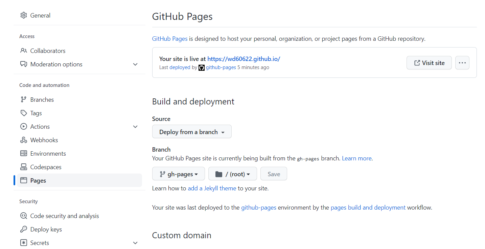

# MkDocs and GitHub Pages

This website was created using [`MkDocs`](https://www.mkdocs.org/), surrounding python packages like [mkdocs-material](https://squidfunk.github.io/mkdocs-material/), and is served with [GitHub pages](https://pages.github.com/). 

## About MkDocs and its plugins

The MkDocs library makes it easy to create documentation from just markdown and YAML files.

With just a few commands, you can quickly iterate with your content and make some great looking webpages.

There is also a handful plugin libraries for MkDocs that allow for additional customization. For instance, the theme used here is from the `mkdocs-material` package. Makes it so easy to have a good looking site on all platforms (especially for people like me who don't make user interfaces often :smile:).

## Creating the Content and Theme

MkDocs really makes it so easy to set up a page. The [Getting Started Section](https://www.mkdocs.org/getting-started/) allows you to get started.

The simpliest project setup will just be two files: 

The themes and capabilities were inspired from the [mkdocs-material](https://squidfunk.github.io/mkdocs-material/) site and exploring its [mkdocs.yml](https://github.com/squidfunk/mkdocs-material/blob/master/mkdocs.yml) helped implement mine.

## Serving with GitHub Pages

GitHub allows you to set up a site for free. If the repo is named `<username>.github.io`, then it will be hosted at `https://<username>.github.io`. 

!!! tip 
    If you deploy with GitHub pages in any other repo, the docs with be hosted at `https://<username>.github.io/<repo-name>`. Super cool and would like to use in the future to make quick project documentation!

All the code to create this site is on my GitHub [here](https://github.com/williambdean/williambdean.github.io).

### GitHub Action

The mkdocs-material documentation has the steps in order to set up your GitHub Action for deploy. Those steps are found [here](https://squidfunk.github.io/mkdocs-material/publishing-your-site/).

### GitHub Page Settings

I had some hiccups while setting up the site. Initially, only my README was being served at <a href="https://williambdean.github.io">https://williambdean.github.io</a>. However, the default **"Deploy from a branch"** setting in the GitHub Pages section was on the `main` branch which only had the README. 

!!! note
    Running `mkdocs gh-deploy` pushes all the html files to `gh-pages` branch in my repo so that branch needed to be selected in the Settings.

Below are Settings section that worked for my deployment.

## Helpful Links

I found these links helpful while setting up this site and writing this post.

- [MkDocs](https://www.mkdocs.org/)
- [MkDocs Material](https://squidfunk.github.io/mkdocs-material/getting-started/)
- [GitHub Pages](https://pages.github.com/)
