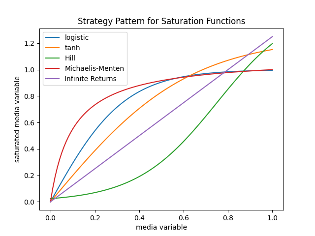

# Strategy Pattern for Flexible Solutions

This is how the [strategy design
pattern](https://refactoring.guru/design-patterns/strategy) was used to create
a flexible solution for Marketing Mix Model (MMM) saturation and adstock
functions in [`pymc-marketing`](https://github.com/pymc-labs/pymc-marketing).

Marketing (Mad) Scientist, [Carlos
Agostini](https://www.linkedin.com/in/cetagostini/), and I worked on this
solution in this [pull
request](https://github.com/pymc-labs/pymc-marketing/pull/632). Check there for
more implementation details.

Following this PR, there is built in support for 4 adstock functions and 5
saturation functions. Not only that, but the solution allows for easy addition
of adstock, saturation ordering. In total, there are **4 * 5 * 2 = 40 new
out-of-the-box MMM combinations** with `pymc-marketing` not including the
ability to add custom adstock and saturation functions as well.

??? info "Out-of-Box Adstock and Saturation Functions"

    **Adstock**

    - Geometric
    - Delayed
    - Weibull CDF
    - Weibull PDF

    **Saturation**

    - Logistic
    - Tanh
    - Tanh Baselined
    - Hill
    - Michaelis-Menten


## Problem

The `pymc-marketing` package requires flexibility in order to support a wide
range of marketing assumptions including how media channels will contribute to the
overall target metric.

These assumptions affect:

- Adstock: how much of the effect of a channel is carried over to the next time
  period.
- Saturation: diminishing returns as the media variable on a channel increases.

**This will focus on the saturation function and how the strategy pattern was
used to create a flexible solution.**

Various saturation functions can be used to model diminishing returns. For
instance, the following functions can be used:

- logistic
- tanh
- Michaelis-Menten

On top of that, all of these functions have different sets of parameters. How might 
all of these functions be used in a flexible way?

## Naive Approach

If there is only one saturation function, the problem is simple. For instance,

```python
from numpy import exp

def logistic(x, lam): 
    return (1 - exp(-lam * x)) / (1 + exp(-lam * x))

def saturation(x, lam): 
    return logistic(x, lam)
```

However, as more functions are added, the problem becomes more complex. For
instance, if a tanh function is added which has different parameters `b` and
`c`, the `saturation` function would need to be updated.

```python
from numpy import tanh

# New function
def tanh_saturation(x, b, c): 
    return b * tanh(x / (b * c))

# New logic
def saturation(x, lam=None, b=None, c=None): 
    if lam is not None: 
        return logistic(x, lam)
    elif b is not None and c is not None: 
        return tanh_saturation(x, b, c)
    else: 
        raise ValueError("Invalid parameters")
```

The Michaelis-Menten function also has a parameter `lam`, so how would this be
added to the `saturation` function?

```python
# Yet another new function
def michaelis_menten(x, lam, alpha): 
    return alpha * x / (x + lam)

# New logic? Yet another parameter? Add a boolean flag?
def saturation(
    x, 
    lam=None, 
    b=None, 
    c=None, 
    alpha=None,
): 
    if lam is not None and alpha is None: 
        return logistic(x, lam)
    if lam is not None and alpha is not None: 
        return michael_menten(x, lam, alpha)
    elif b is not None and c is not None: 
        return tanh_saturation(x, b, c)
    else: 
        raise ValueError("Invalid parameters")
```

This approach quickly became unwieldy and hard to understand, scale, and
maintain.

Logic that is both flexible and can easily be extended without having to modify
existing code is required!

## Strategy Pattern

The strategy pattern is a behavioral design pattern that can help solve this
problem.

### Define a Common Interface

By defining a common function signature, we can create this flexible system.
For instance, we can pose the definition that a saturation function will always
take a single argument and return a single value. 

```python
from typing import Callable
from numpy.typing import ArrayLike 

SaturationFunction = Callable[[ArrayLike], ArrayLike]
```

The previously defined functions do not go to waste as they can be used to create
functions that adhere to the `SaturationFunction` signature.

```python
def create_logistic_saturation(lam) -> SaturationFunction: 
    def saturation_function(x): 
        return logistic(x, lam)
    return saturation_function

def create_tanh_saturation(b, c) -> SaturationFunction: 
    def saturation_function(x):
        return tanh_saturation(x, b, c)
    return saturation_function

def create_michaelis_menten_saturation(lam, alpha) -> SaturationFunction: 
    def saturation_function(x): 
        return michaelis_menten(x, lam, alpha)
    return saturation_function
```

Each one of these functions is a wrapper that returns a function that adheres
to the `SaturationFunction` signature. The parameters are passed in the wrapper
function and the returned function only takes the media variable `x`.

!!! tip 
    The `functools.partial` function can also be used to create these functions

    ```python
    from functools import partial

    saturation_function: SaturationFunction = partial(logistic, lam=0.1)
    ```

### Two Step Process

By defining a wrapper function, this breaks the process into two steps: 

1. Creation
1. Application

```python
# Creation
saturation = create_logistic_saturation(lam=0.1)

# Application
saturation(0.5)
```

### Benefits


#### Common Interface

Switching to a different saturation function is as simple as changing the
creation step because the application step remains the same.

```python
saturation = create_tanh_saturation(b=0.1, c=0.2)

# Same as before 
saturation(0.5)
```

Even though the creation step is different, the application step remains the
same.

#### Extensibility

There is also the benefit that new functions can be created without having
to modify existing code. The defined signature ensures that the new function
will work with the existing code.

```python
def create_infinite_returns(beta) -> SaturationFunction: 
    def saturation_function(x): 
        return beta * x
    return saturation_function

def hill(x, sigma, beta, lam): 
    return sigma / (1 + exp(-beta * (x - lam)))

def create_hill_saturation(sigma, beta, lam) -> SaturationFunction: 
    def saturation_function(x): 
        return hill(x, sigma, beta, lam)
    return saturation_function
```

Even with user defined functions, the application step remains the same!

```python
# User defined saturation function
saturation = create_hill_saturation(sigma=0.1, beta=0.2, lam=0.3)

# Still the same as before!
saturation(0.5)
```

### Usage Example

Because of the common interface, these created functions can be passed around
making that naive `saturation` function no longer necessary.

Below showcases all of the saturation functions in action which can be easily
used due to the common interface.

```python
import numpy as np
import matplotlib.pyplot as plt

# Creation
saturation_functions = {
    "logistic": create_logistic_saturation(lam=6),
    "tanh": create_tanh_saturation(b=1.25, c=0.5),
    "Hill": create_hill_saturation(sigma=1.5, beta=5.5, lam=0.75),
    "Michaelis-Menten": create_michaelis_menten_saturation(lam=0.1, alpha=1.1),
    "Infinite Returns": create_infinite_returns(beta=1.25),
}

# Application
ax = plt.subplot(111)

x = np.linspace(0, 1, 100)

for name, saturation in saturation_functions.items(): 
    y = saturation(x)
    ax.plot(x, y, label=name)

ax.legend()
ax.set(
    xlabel="media variable", 
    ylabel="saturated media variable",
    title="Strategy Pattern for Saturation Functions",
)
```



## `pymc-marketing` Solution

There are a few additional requirements that are needed for the
`pymc-marketing` solution. For instance, the need for:

- Prior for each function parameter
- Parameter estimation with `pymc`
- Additional non-parameter arguments
- Non-clashing parameter names with larger model variables
- Lift test support
- Budget optimization

The final solution ended up looking like this for each saturation function:

```python
from pymc_marketing.mmm import SaturationTransformation

class InfiniteReturns(SaturationTransformation): 
    def function(self, x, alpha): 
        return alpha * x

    default_priors = {
       "alpha": {
           "dist": "HalfNormal", 
           "kwargs": {"sigma": 0.1},
       },
    }
```

Though there is a little more boilerplate, the two step process is still used.

1. Creation
1. Application

```python
saturation = InfiniteReturns()

x = np.linspace(0, 1, 100)

with pm.Model():
    saturated_x = saturation.apply(x)
```

There is much that comes for free with the `SaturationTransformation` class
including the `apply` method which handles the common logic of creating PyMC
distributions for the parameters of the `function` method based on
`default_priors` while also ensuring a common interface for all saturation
functions.

Using this solution for the adstock and saturation functions in
`pymc-marketing` provides the flexibility needed to support a wide range of
marketing assumptions.

```python title="pymc-marketing solution in action"
from pymc_marketing.mmm import (
    MMM,
    MichaelisMentenSaturation 
    WeibullAdstock, 
)

# Creation
adstock = WeibullAdstock(kind="PDF", l_max=7)

saturation_priors = {
    "lam": {"dist": "HalfNormal", "kwargs": {"sigma": 0.1}},
    "alpha": {"dist": "Gamma", "kwargs": {"alpha": 1, "beta": 2}},
}
saturation = MichaelisMentenSaturation(priors=saturation_priors)

# Application
mmm = MMM(
    ...,
    adstock=adstock,
    saturation=saturation,
    ...,
)
mmm.fit(X, y)
```

## Summary

By defining a common function signature for all adstock and saturation
functions, we get flexibility and ease addition of new functions without the
need to update existing code. 

This breaks down the process into two steps:

1. Creation
1. Application

This has been helpful to support a wide range of marketing assumptions required
in `pymc-marketing`. 
